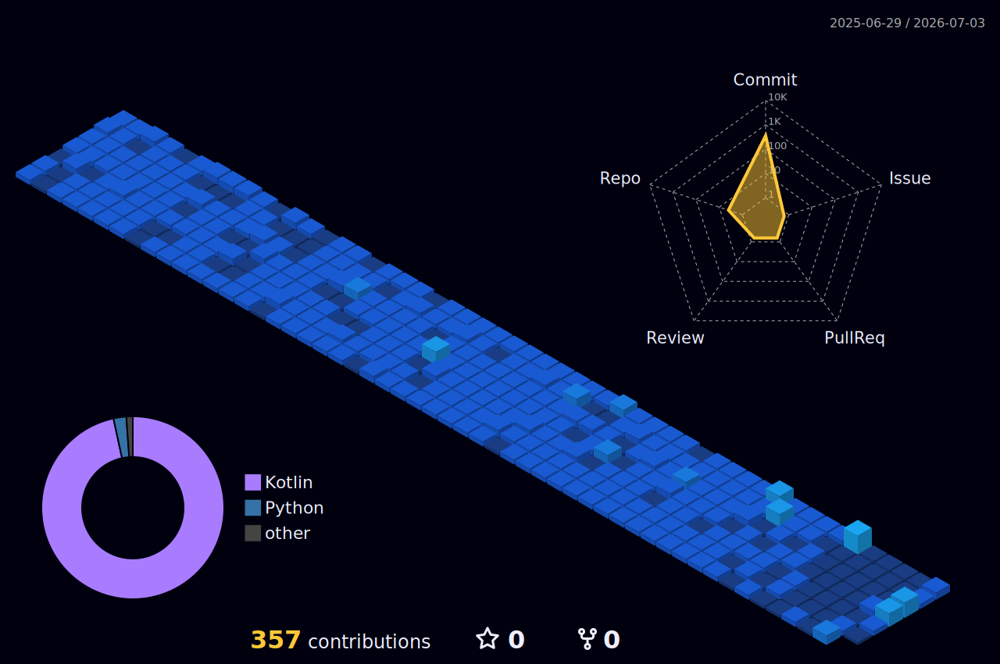

<div align="center">


[](https://git.io/typing-svg)

</div>

---

## 관심 분야

```text
On-Device AI        Local LLM           RAG System
AI Agent            Edge Inference      Computer Vision
Autonomous Driving  Sim2Real            Research Automation
Document AI         Workflow Automation Privacy-first AI
````

---

## 기술 스택

### AI / ML / LLM

<p>
  
  
  
  
  
  
  
  
  
</p>

### Backend / Application

<p>
  
  
  
  
  
</p>

### Frontend

<p>
  
  
  
  
</p>

### Data / Automation / Infra

<p>
  
  
  
  
  
  
</p>

### Tools

<p>
  
  
  
  
  
</p>

---

## 대표 프로젝트

### Edge Autonomous Driving & VLM QLoRA with CARLA

> CARLA 시뮬레이션 환경에서 자율주행 인지 모델 최적화 프로젝트 & VLM 기반 E2E 자율주행 연구 프로젝트

<p>
  
  
  
  
  
  
  
  
  
  
</p>

* CARLA 기반 RGB / Semantic Camera 데이터 수집
* U-Net 기반 차선 영역 분할
* YOLO 기반 객체 탐지
* ONNX 변환 및 TensorRT 최적화 실험
* FP16 / INT8 기반 엣지 추론 성능 비교

🔗 Repository (Edge AI): [Danpun9/edge-autonomous-driving-carla](https://github.com/Danpun9/edge-autonomous-driving-carla)
* Vision-Language Model(VLM)을 활용한 End-to-End 자율주행 모델 연구
* QLoRA 기법을 통한 파라미터 효율적 미세조정(PEFT) 적용


🔗 Repository (VLM QLoRA): [Danpun9/E2E-QLoRA-Autonomous-Driving-CARLA](https://github.com/Danpun9/E2E-QLoRA-Autonomous-Driving-CARLA)

---

### MemoCore

> 로컬 문서 기반 RAG와 온디바이스 AI를 활용한 개인정보 보호형 AI 워크스페이스

<p>
  
  
  
  
  
  
</p>

* 사용자의 로컬 문서를 기반으로 질의응답을 수행하는 AI 워크스페이스
* PDF, DOCX, Markdown 문서를 대상으로 한 RAG 파이프라인 설계
* 로컬 모델 / 온디바이스 모델 / 클라우드 모델을 선택적으로 활용할 수 있는 구조
* 문서 검색, 요약, 답변 생성을 연결하는 에이전트형 워크플로 지향

🔗 Repository: [Danpun9/memocore](https://github.com/Danpun9/memocore)

---

### Bask:EAT

> AI 레시피 추천, 영상 기반 레시피 추출, 식재료 인식, 쇼핑 연계를 포함한 푸드테크 AI 서비스

<p>
  
  
  
  
  
  
</p>

* Gemini API와 LangChain을 활용한 AI 레시피 어시스턴트
* YouTube 영상 기반 레시피 정보 추출
* 식재료 이미지 인식 및 상품 검색
* Spring Boot, FastAPI, Next.js 기반 서비스 구조
* 팀 프로젝트 리딩 및 서비스 아키텍처 설계 경험

🔗 Organization: [Bask-EAT](https://github.com/Bask-EAT)

---

### PaperC0re

> arXiv 논문 수집, AI 요약, 키워드 태깅, 뉴스레터 발송을 자동화하는 연구 정보 수집 시스템

<p>
  
  
  
  
  
  
</p>

* 키워드 기반 arXiv 논문 수집
* LLM 기반 논문 요약 및 주요 용어 분석
* 논문 중복 제거 및 키워드 태깅
* n8n 기반 자동화 워크플로 설계
* 연구 주제별 뉴스레터 발송 구조

🔗 Organization: [PaperC0re](https://github.com/PaperC0re)

---

## 활동



---

## Profile Summary Cards

<div align="center">


</div>

---

## 연락처

<p>
  <a href="mailto:joonseekpark@gmail.com">
    
  </a>
  <a href="https://github.com/Danpun9">
    
  </a>
</p>


